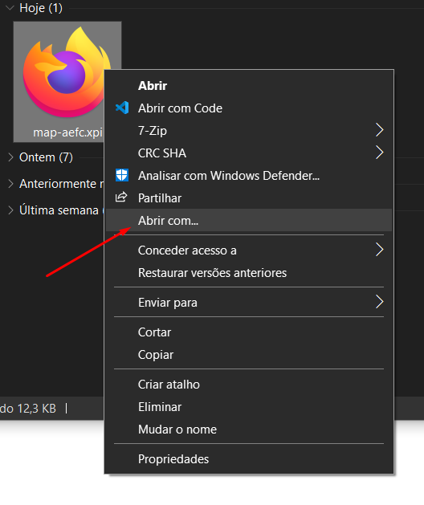
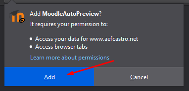

## Moodle Auto-Preview - AEFC
### O que é?
O Moodle Auto Preview é uma extensão para Firefox, Opera e outros browsers baseados no Chrome (Ver em baixo browsers suportados) que abre ficheiros carregados para o Moodle diretamente no browser, sem haver a necessidade de descarregar.
### Browsers Suportados 
* Mozilla Firefox
* Opera / Opera GX
* Chrome (Apenas Dev e Canary)

### Como instalar
#### Mozilla Firefox
O Firefox é o browser recomendado para utilizar a extensão. A extensão segue as recomendações da Mozilla, apesar destas se aplicarem também aos outros browsers

##### Guia passo a passo:
1. Fazer download da extensão [aqui](https://github.com/bernawastaken/moodleautopreview-aefc/blob/master/extensions/map-aefc.xpi?raw=true)
2. Selecionar "Guardar ficheiro" 
3. Abrir a pasta de Downloads 
4. Clicar com o botão direito do rato e selecionar "Abrir com..." 
5. Selecionar "Firefox" 
6. Selecionar "Adicionar ao Firefox" 
7. Selecionar "Ok, entendi" 
8. Voilà! A extensão está instalada!  

#### Opera / Opera GX
O Opera GX é o browser baseado no Chrome recomendado. A Google a a Microsoft bloqueiam a instalação de extensões de lojas não oficiais, portanto o Opera é uma boa escolha. Apesar de o Firefox ser o browser recomendado, o Opera poderá funcionar mas não garantimos a execução sem problemas.

##### Guia passo a passo:
1. Fazer download da extensão [aqui](https://github.com/bernawastaken/moodleautopreview-aefc/blob/master/extensions/map-aefc.crx?raw=true)
2. Abrir a pasta de Downloads 
3. Clicar com o botão direito do rato e selecionar "Abrir com..." 
4. Selecionar "Opera" 
5. Clicar em "Ir para Extensões" 
6. Clicar em "Instalar" 
7. Clicar em "Sim, Instalar" 
8. Voilà! A extensão está instalada!  